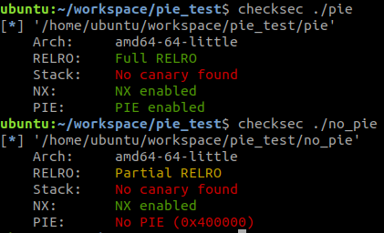
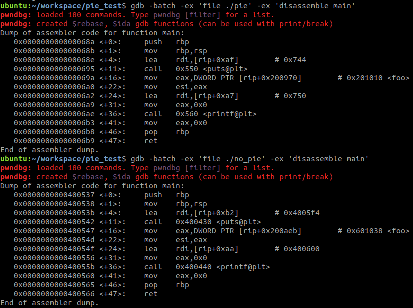

# PIE(Position Independent Executable)
  
1. pie가 걸린것과 안걸린것의 차이
2. aslr과의 연관관계 설명 
    시스템에 aslr이 꺼져있을 경우 ? 켜있을 경우 차이? 


## PIE 
위치 독립 실행 파일로 실행될 때마다 매핑되는 주소가 어디든 상관없이 실행되는 파일   
맵핑되는 주소와 상관없이 실행이 가능하단 뜻은 symbol들의 주소값이 절대값이 아니라 상대값(offset)이란 것  
PIE가 걸린 파일과 안걸린 파일을 보면 좀더 확연히 차이를 알 수 있음   


##TODOLIST
It turns out to be quite simple to create a PIE: a PIE is simply an executable shared library. To make a shared library executable you just need to give it a PT_INTERP segment and appropriate startup code. The startup code can be the same as the usual executable startup code, though of course it must be compiled to be position independent.

## PIE build option
```
# PIE 적용 ( ubuntu 18.04 , gcc 7.4 에선 default로 PIE가 적용되어 있음. )
gcc -fPIE -o pie pie.c
gcc -o pie pie.c 

# PIE 해제 
gcc -no-pie -o no_pie pie.c
```

## PIE vs no_PIE
*file* 명령 또는 *checksec*을 통해서 차이를 확인 할 수 있으며, *disassemble*을 통해서도 확인 가능 



symbol이 맵핑된 주소를 보게 되면 PIE가 적용된 경우 offset 값으로  맵핑되어 있으며, PIE가 적용 안되었을 때에는 절대값으로 맵핑되어 있음.gdb를 통해서 실제 실행될 때 주소값을 확인해 보면 PIE가 적용되지 않은 실행파일은 disassemble해서 보인 주소값이 그대로 사용되며 PIE 가 적용된 파일은 실행될 때 결정된 image base address에 해당 symbol의 주소값(offset)이 더해져 사용된다.


## references 
- PIC 관련 artical : <https://eli.thegreenplace.net/2011/11/03/position-independent-code-pic-in-shared-libraries>
- PIC 관련 x64 article : <https://eli.thegreenplace.net/2011/11/03/position-independent-code-pic-in-shared-libraries>


